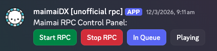
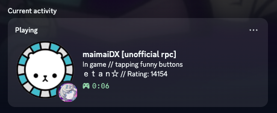

# mairpc

Unofficial RPC controller for funny arcade game

> [!IMPORTANT]
> You will need a machine running either the Discord desktop client or another client capable of handling Discord's Rich Prescence (Vesktop will work). This machine will have to be on when you actually wish to control RPC.

## Features

* Showing whether you're in queue or playing
* Displaying maimai rating
* (manual) maimai icon display

## Previews

## Setup

You will need discordbot.py, requirements.txt, and rpchandler.py. You'll also need to create a Discord bot at the [Discord Developer Portal](https://discord.com/developers/applications).

### Setup > Discord Client

Very simple.

Simply open Discord (or an alternative like Vesktop) and you're good to go. Discord on the browser will not work unless you have Vencord and arrpc installed.

> [!NOTE]
> Incase this wasn't obvious, your activity will not show when you are set to Invisible mode.

### Setup > Discord Bot

Step by step.

1. Log on to the [Discord Developer Portal](https://discord.com/developers/applications).
2. Create a new application using the button on the top right. The application's name will be your activity (for example, if you named your bot "maimai", your activity will be shown as "Playing maimai")
3. Add a new app icon. This will be the bot's profile picture.
4. Under the Overview tab, click on "Bot", and reset the bot's token. Copy the new token and keep it somewhere, you'll need it later!
5. Under the Overview tab again, click on "Rich Presence", then "Art Assets".
6. Create two new images and name them "maimai" and "pfpicon". The "maimai" image will show as the big image, while the "pfpicon" will show as the smaller image, as shown in the preview.
7. Under the Overview tab again again, click on "OAuth2", and scroll down to the generator. Click on "bot", then scroll down.
8. Under bot permissions, check the "Send Messages" permission.
9. Scroll down again, make sure Integration Type is set to "Guild Install", then copy the generated URL. Paste the url into your favourite browser, and add the bot to your server. It's recommended for you to add this to a server that only contains you and the bot.
10. Copy the Channel ID of the text channel that the bot should send the buttons to. If the Copy ID button doesn't show after right clicking, go to Discord settings > Advanced, then turn on Developer mode.

###  Setup > Python Program

Install all the required Python modules in requirements.txt:

`pip install -r requirements.txt`

Then, run either discordbot.py or rpchandler.py. Both programs will create a new `env.json`, where you will have to input your bot token, user id, channel id (to send the buttons to), and your maimai username to display on your profile.

Once that's done, hit enter, and the program will close. Re-run both discordbot.py and rpchandler.py, and you'll be good to go!

## How it works
The discordbot.py script handles user interactions, such as when you press a button to start your rich presence, or to update your rating. These interactions are sent to rpchandler.py via POST requests.
The rpchandler.py script creates a new Flask instance, allowing the script to recieve various requests, as well as creating, updating, and closing RPC connections. When rpchandler receives a POST request, it starts/updates/closes the RPC client. 

## Other notes
* Use /setrating to update your rating on the RPC. Please do note that if you close discordbot.py, your rating will not save and you will have to update it again.